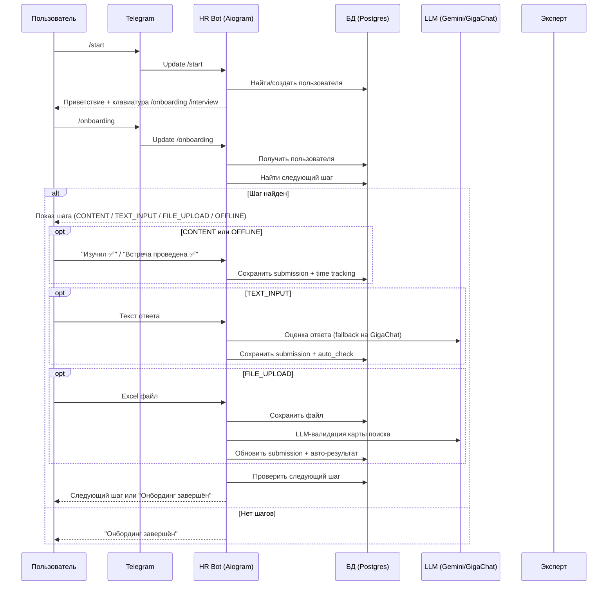

# HR Training Bot - Сценарии использования (Use Cases)

> **Версия:** 1.2  
> **Дата обновления:** 2025-12-08  
> **Статус:** Боевой режим ✅

## 📋 Содержание

0. [Диаграмма последовательности (онбординг)](#-диаграмма-последовательности-онбординг)
0.1. [Диаграмма потока (бот, PlantUML)](#-диаграмма-потока-бот-plantuml)
1. [Быстрый старт](#быстрый-старт)
2. [Регистрация и начало работы](#1-регистрация-и-начало-работы)
3. [Прохождение онбординга](#2-прохождение-онбординга)
4. [Тренировка интервью](#3-тренировка-интервью)
5. [Типы заданий](#5-типы-заданий)
6. [Устранение неполадок](#6-устранение-неполадок)

---

## 🧭 Диаграмма последовательности (онбординг)



---

## 🧩 Диаграмма потока (бот, PlantUML)

```plantuml
@startuml
title Поток работы Telegram-бота HR Training

start
:Команда /start;
if (Пользователь есть в БД?) then (нет)
  :Запросить ФИО;
  :Сохранить пользователя;
endif
:Показать клавиатуру (/onboarding, /interview);

switch (Команда)
case (/onboarding)
  :Определить следующий шаг;
  if (Шаг найден?) then (да)
    :Показ шага (тип CONTENT / TEXT_INPUT / FILE_UPLOAD / OFFLINE);
    if (CONTENT или OFFLINE) then (да)
      :Пользователь жмет "Изучил ✅" или "Встреча проведена ✅";
      :Сохранить submission + time tracking;
    else (нет)
      if (TEXT_INPUT) then (да)
        :Получить текст ответа;
        :LLM оценка (Gemini -> fallback GigaChat);
        :Сохранить submission + автооценка;
      else (FILE_UPLOAD)
        :Получить Excel;
        :LLM-валидация карты поиска;
        :Сохранить submission + автоотчет;
      endif
    endif
    :Проверить следующий шаг;
    if (Есть следующий?) then (да)
      :Показать следующий шаг;
    else (нет)
      :Сообщить "Онбординг завершён";
    endif
  else (нет)
    :Сообщить "Онбординг завершён";
  endif
  break
case (/interview)
  :Показ списка кандидатов;
  :Запуск интервью-сессии;
  :Диалог с LLM (Gemini -> fallback GigaChat);
  :Сохранить transcript + chat_history;
  break

else (другое)
  :Сообщить об ошибке/непонятной команде;
endswitch

stop
@enduml
```

---

## 🚀 Быстрый старт

### Первый запуск бота

1. **Найдите бота в Telegram** по имени `@k_p_lab_one_bot` (или другому, указанному администратором)

2. **Отправьте команду `/start`**
   ```
   Вы: /start
   
   Бот: Welcome to the HR Interviewer Training System! 
        Please enter your full name to register.
   ```

3. **Введите своё полное имя**
   ```
   Вы: Иван Иванов
   
   Бот: Nice to meet you, Иван Иванов! You are now registered.
   ```

4. **Готово!** Теперь вы можете:
   - `/onboarding` - пройти онбординг (alias `/labs`)
   - `/interview` - тренировать интервью

### Проверка работоспособности

При запуске бота в логах вы увидите:
```
✅ LLM model ready: gemini-1.5-flash (GEMINI)
🤖 Bot starting...
```

Или если используется GigaChat fallback:
```
✅ LLM model ready: GigaChat (GIGACHAT)
🤖 Bot starting...
```

Если модель не инициализирована:
```
⚠️ LLM model not initialized. Interview features may not work.
   This might be due to regional restrictions. Consider using VPN or GigaChat.
```

**Важно:** 
- Бот автоматически переключается на GigaChat, если Gemini недоступен в вашем регионе
- Для использования GigaChat настройте `GIGACHAT_CLIENT_ID` и `GIGACHAT_CLIENT_SECRET` в `.env`
- Или используйте VPN для доступа к Gemini API

---

## 1. Регистрация и начало работы

### Use Case 1.1: Первый запуск бота

**Актор:** Новый пользователь (студент)

**Предусловия:** 
- Пользователь открыл бота в Telegram
- Бот запущен и работает

**Основной сценарий:**
1. Пользователь отправляет команду `/start`
2. Бот приветствует пользователя:
   ```
   Welcome to the HR Interviewer Training System! 
   Please enter your full name to register.
   ```
3. Пользователь вводит своё полное имя (например: "Иван Иванов")
4. Бот сохраняет пользователя в базе данных и отвечает:
   ```
   Nice to meet you, Иван Иванов! You are now registered.
   ```
5. Регистрация завершена

**Реальный пример диалога:**
```
👤 Вы: /start

🤖 Бот: Welcome to the HR Interviewer Training System! 
        Please enter your full name to register.

👤 Вы: Алексей Каспшицкий

🤖 Бот: Nice to meet you, Алексей Каспшицкий! You are now registered.
```

**Альтернативный сценарий 1.1.1:** Пользователь уже зарегистрирован
- Если пользователь с таким Telegram ID уже существует, бот обновляет его имя

**Результат:** Пользователь зарегистрирован в системе и может начинать обучение

---


---

## 2. Прохождение онбординга

> Команда: `/onboarding` (alias `/labs`). Новый сценарий: вопрос → изучение материала → рассказ → автооценка → загрузка карты поиска.

### Use Case 2.1: Старт онбординга и цепочка шагов

**Актор:** Зарегистрированный студент

**Предусловия:**
- Пользователь зарегистрирован через `/start`

**Основной сценарий:**
1. Пользователь отправляет команду `/onboarding` (или `/labs` для обратной совместимости).
2. Бот выбирает следующий незавершённый шаг из цепочки:
   - **Шаг 1 (QUESTION):** контрольный вопрос о цели онбординга
   - **Шаг 2 (CONTENT):** ссылка на материал для изучения
   - **Шаг 3 (SELF_REPORT):** пользователь кратко описывает, что понял
   - **Шаг 4 (EVALUATION):** бот/LLM оценивает предыдущий ответ и даёт рекомендации
   - **Шаг 5 (FILE_UPLOAD):** загрузка карты поиска (Excel), автопроверка + LLM-подсказки
3. Для каждого шага бот показывает название, описание, ссылку (если есть) и оценочное время.
4. Типы шагов и действия:
   - `CONTENT`/`OFFLINE` → кнопка **"Готово ✅"**
   - `QUESTION`/`SELF_REPORT`/`TEXT_INPUT` → бот ждёт текст, сохраняет и помнит его для оценки
   - `EVALUATION` → кнопка **"Оценить результат"**, LLM считает скор и комментарий, сохраняется в прогресс
   - `FILE_UPLOAD` → загрузка Excel, базовая проверка + LLM-подсказки по содержанию
5. После завершения шага бот фиксирует время, записывает статус и переводит на следующий шаг.

**Результат:** Пользователь проходит онбординг от вопроса до загрузки карты поиска; все шаги и история сохраняются.

---

### Use Case 2.2: Выполнение задания типа CONTENT (чтение/просмотр)

**Актор:** Студент

**Предусловия:**
- Пользователь начал шаг через `/onboarding`
- Шаг имеет тип `CONTENT` (например, "Изучить бизнес-процесс по подбору персонала")

**Основной сценарий:**
1. Бот показывает задание с кнопкой "Done ✅"
2. Пользователь изучает материалы (переходит по ссылке, читает документы)
3. После изучения пользователь нажимает кнопку "Done ✅"
4. Бот фиксирует время выполнения
5. Бот проверяет время выполнения:
   - Если выполнено слишком быстро (< 30% от оценочного времени) → предупреждение
   - Если слишком медленно (> 300% от оценочного времени) → заметка
6. Бот сохраняет выполнение и переходит к следующему шагу

**Реальный пример предупреждения:**
```
👤 Вы: [Нажимает "Done ✅" через 2 минуты после начала]

🤖 Бот: ⚠️ Time warning: You completed this step in 2.0 minutes, 
        but it was estimated to take 15 minutes. 
        Please make sure you completed all required activities.
        
        Marked as done.
        
        Moving to the next step...
        
        Step 2: Изучить бизнес-процесс по подбору персонала
        ...
```

**Результат:** Задание отмечено как выполненное, пользователь переходит к следующему шагу

---

### Use Case 2.3: Выполнение задания типа TEXT_INPUT (текстовый ответ)

**Актор:** Студент

**Предусловия:**
- Пользователь начал шаг через `/onboarding`
- Шаг имеет тип `TEXT_INPUT` (например, "Задание: «Продающий» анонс")

**Основной сценарий:**
1. Бот показывает задание и просит ввести ответ:
   ```
   Step 9: Задание: «Продающий» анонс
      
   Написать, зачем нужен «продающий» анонс.
   
   Duration: 5 min
   
   👇 Please type your answer below:
   ```
2. Пользователь вводит текстовый ответ
3. Бот сохраняет ответ и подтверждает:
   ```
   Answer saved.
   
   Moving to the next step...
   ```
4. Бот проверяет время выполнения (аналогично Use Case 2.2)
5. Бот переходит к следующему шагу

**Реальный пример:**
```
🤖 Бот: Step 9: Задание: «Продающий» анонс
       
       Написать, зачем нужен «продающий» анонс.
       
       Duration: 5 min
       
       👇 Please type your answer below:

👤 Вы: Продающий анонс нужен для привлечения внимания 
      кандидатов и мотивации их откликнуться на вакансию.

🤖 Бот: Answer saved.
       
       Moving to the next step...
       
       Step 10: Задание: Некруглые числа
       ...
```

**Альтернативный сценарий 2.3.1:** Пользователь отправил не текст (например, фото)
```
👤 Вы: [Отправляет фото вместо текста]

🤖 Бот: Please enter text.
```

**Результат:** Текстовый ответ сохранён, пользователь переходит к следующему шагу

---

### Use Case 2.4: Выполнение задания типа FILE_UPLOAD (загрузка файла)

**Актор:** Студент

**Предусловия:**
- Пользователь начал шаг через `/labs`
- Шаг имеет тип `FILE_UPLOAD` (например, "Задание: Карта поиска (Оценочный лист)")

**Основной сценарий:**
1. Бот показывает задание и просит загрузить Excel-файл
2. Пользователь загружает файл (.xlsx или .xls)
3. Бот сохраняет файл на сервере
4. Бот выполняет базовую валидацию:
   - Проверка структуры (наличие обязательных колонок)
   - Проверка содержимого (заполненность полей)
5. Бот выполняет LLM-валидацию (проверка логической согласованности через Gemini AI)
6. Бот показывает результаты проверки:
   - Если есть проблемы → список найденных проблем и рекомендации
   - Если всё хорошо → подтверждение
7. Бот сохраняет результат и переходит к следующему шагу

**Реальный пример ответа с проблемами:**
```
👤 Вы: [Загружает Excel-файл]

🤖 Бот: ⚠️ Basic validation issues:
        Too many empty contacts (>50%)
        
        🤖 LLM Validation found issues:
        • Противоречие между требованиями к hard skills и описанием должности
        • Отсекающие факторы слишком строгие для данной позиции
        
        💡 Suggestions:
        • Рекомендуется смягчить требования к опыту работы
        • Добавить больше soft skills, связанных с коммуникацией
        
        ✅ Submission saved for expert review.
        
        Moving to the next step...
```

**Реальный пример успешной проверки:**
```
👤 Вы: [Загружает корректный Excel-файл]

🤖 Бот: ✅ File accepted! Auto-checks passed.
       
       Moving to the next step...
```

**Альтернативный сценарий 2.4.1:** Неверный формат файла
```
👤 Вы: [Загружает файл .pdf или .docx]

🤖 Бот: Please upload a valid Excel file.
```

**Альтернативный сценарий 2.4.2:** Ошибка загрузки файла
```
👤 Вы: [Загружает повреждённый файл]

🤖 Бот: Error loading file: Failed to load file: [детали ошибки]
```

**Альтернативный сценарий 2.4.3:** Сессия истекла
```
👤 Вы: [Загружает файл после долгого ожидания]

🤖 Бот: Session expired. Please type /labs again.
```

**Результат:** Файл загружен, проверен и сохранён. Пользователь получает обратную связь и переходит к следующему шагу

---

### Use Case 2.5: Выполнение задания типа OFFLINE (офлайн встреча)

**Актор:** Студент

**Предусловия:**
- Пользователь начал шаг через `/labs`
- Шаг имеет тип `OFFLINE` (например, "Вводная встреча")

**Основной сценарий:**
1. Бот показывает задание с кнопкой "Done ✅"
2. Пользователь проводит офлайн-встречу (встречается с наставником, руководителем)
3. После встречи пользователь нажимает "Done ✅"
4. Бот фиксирует выполнение и переходит к следующему шагу

**Результат:** Офлайн-задание отмечено как выполненное

---

## 3. Тренировка интервью

### Use Case 3.1: Начало тренировки интервью

**Актор:** Студент

**Предусловия:**
- Пользователь зарегистрирован
- В системе есть кандидаты для интервью

**Основной сценарий:**
1. Пользователь отправляет команду `/interview`
2. Бот показывает список доступных кандидатов в виде кнопок:
   ```
   Choose a candidate to interview:
   
   [Мария Петрова]
   [Дмитрий Токсиков]
   [Иван Молчунов]
   [Ольга Туманная]
   ```
3. Пользователь выбирает кандидата (нажимает на кнопку с именем)
4. Бот показывает информацию о кандидате:
   ```
   Interview started with Дмитрий Токсиков ☠️
   Psychotype: Toxic
   
   Resume: Менеджер по продажам, 7 лет опыта...
   
   Say 'Hello' to start. Type /stop to finish.
   ```
5. Бот переводит пользователя в режим интервью

**Реальный пример:**
```
👤 Вы: /interview

🤖 Бот: Choose a candidate to interview:
       
       [Мария Петрова]  [Дмитрий Токсиков]
       [Иван Молчунов]  [Ольга Туманная]

👤 Вы: [Нажимает "Дмитрий Токсиков"]

🤖 Бот: Interview started with Дмитрий Токсиков ☠️
       Psychotype: Toxic
       
       Resume: Менеджер по продажам, 7 лет опыта.
       Образование: финансовый техникум.
       Опыт работы:
       - Начальник отдела продаж в стартапе (1 год): 
         уволился из-за конфликта с руководством
       ...
       
       Say 'Hello' to start. Type /stop to finish.
```

**Альтернативный сценарий 3.1.1:** Кандидатов нет в системе
- Бот автоматически создаёт тестового кандидата

**Результат:** Пользователь готов начать интервью с выбранным кандидатом

---

### Use Case 3.2: Проведение интервью с Target кандидатом

**Актор:** Студент (интервьюер)

**Предусловия:**
- Пользователь выбрал кандидата через `/interview`
- Выбран кандидат типа "Target" (Мария Петрова)

**Основной сценарий:**
1. Пользователь приветствует кандидата: *"Здравствуйте, Мария!"*
2. Бот (кандидат) отвечает развёрнуто и конструктивно, основываясь на резюме
3. Пользователь задаёт вопросы:
   - *"Расскажите о вашем опыте работы"*
   - *"Какие ваши сильные стороны?"*
   - *"Почему вы хотите работать в нашей компании?"*
4. Бот отвечает как идеальный кандидат:
   - Развёрнутые ответы
   - Конкретные примеры из опыта
   - Вопросы к интервьюеру
   - Показывает заинтересованность
5. Пользователь завершает интервью командой `/stop` или *"stop"*
6. Бот подтверждает: *"Interview finished."*

**Реальный пример диалога:**
```
👤 Вы: Здравствуйте, Мария!

🤖 Бот (кандидат): Здравствуйте! Очень приятно познакомиться. 
                   Спасибо за возможность рассказать о себе.

👤 Вы: Расскажите о вашем опыте работы

🤖 Бот (кандидат): У меня 5 лет опыта в HR. Начинала как рекрутер 
                   в аутсорсинговом агентстве, где занималась массовым 
                   подбором. Затем перешла в IT-компанию, где работала 
                   HR-менеджером. Там я занималась не только подбором, 
                   но и адаптацией новых сотрудников, обучением, 
                   оценкой персонала. Мне удалось сократить time-to-hire 
                   на 30% и внедрить систему онбординга, которая 
                   значительно улучшила опыт новых сотрудников.

👤 Вы: Какие ваши сильные стороны?

🤖 Бот (кандидат): Я считаю своими сильными сторонами умение быстро 
                   находить общий язык с людьми, аналитический подход 
                   к оценке кандидатов и опыт работы с различными 
                   ATS-системами. Также я постоянно развиваюсь - 
                   изучаю новые методики интервьюирования и оценки 
                   персонала. Английский язык на уровне B2 позволяет 
                   мне работать с международными кандидатами.
```

**Результат:** Пользователь получил опыт проведения интервью с конструктивным кандидатом

---

### Use Case 3.3: Проведение интервью с Toxic кандидатом

**Актор:** Студент (интервьюер)

**Предусловия:**
- Выбран кандидат типа "Toxic" (Дмитрий Токсиков)

**Основной сценарий:**
1. Пользователь начинает интервью
2. Бот отвечает как токсичный кандидат:
   - Агрессивные и критичные ответы
   - Негативные отзывы о прошлых работодателях
   - Высокомерие и завышенное самомнение
   - Провокационные вопросы
3. Пользователь учится работать с конфликтными ситуациями
4. Пользователь завершает интервью

**Реальный пример диалога:**
```
👤 Вы: Здравствуйте, Дмитрий!

🤖 Бот (кандидат): Здравствуйте. Наконец-то начали интервью. 
                   Я ждал уже несколько минут.

👤 Вы: Почему вы ушли с предыдущего места работы?

🤖 Бот (кандидат): Ну, там было некомпетентное руководство. 
                   Они не понимали, как правильно организовать 
                   работу отдела продаж. Я предлагал множество 
                   улучшений, но меня не слушали. В итоге я ушёл, 
                   потому что не хочу работать с такими людьми.

👤 Вы: Расскажите о ваших достижениях

🤖 Бот (кандидат): Я всегда перевыполнял план, но меня недооценивали. 
                   На предыдущем месте я увеличил продажи на 40%, 
                   но вместо благодарности получил выговор за то, 
                   что "не так общался с клиентами". Это полная чушь, 
                   я просто эффективный менеджер, а они не могут это оценить.

👤 Вы: /stop

🤖 Бот: Interview finished.
```

**Результат:** Пользователь получил опыт работы с конфликтным кандидатом

---

### Use Case 3.4: Проведение интервью с Silent кандидатом

**Актор:** Студент (интервьюер)

**Предусловия:**
- Выбран кандидат типа "Silent" (Иван Молчунов)

**Основной сценарий:**
1. Пользователь задаёт вопросы
2. Бот отвечает минимально:
   - Односложные ответы: "Да", "Нет", "Не знаю"
   - Краткие фразы (1-2 предложения)
   - Не развивает мысли
3. Пользователь учится задавать открытые вопросы и получать развёрнутые ответы
4. Пользователь завершает интервью

**Реальный пример диалога:**
```
👤 Вы: Здравствуйте, Иван!

🤖 Бот (кандидат): Привет.

👤 Вы: Расскажите о себе

🤖 Бот (кандидат): Я программист. Работаю с Python.

👤 Вы: Какой у вас опыт работы?

🤖 Бот (кандидат): Год.

👤 Вы: Что вас мотивирует в работе?

🤖 Бот (кандидат): Не знаю. Просто нравится программировать.

👤 Вы: Можете рассказать подробнее о ваших проектах?

🤖 Бот (кандидат): Учебные веб-приложения.
```

**Результат:** Пользователь получил опыт работы с молчаливым кандидатом

---

### Use Case 3.5: Проведение интервью с Evasive кандидатом

**Актор:** Студент (интервьюер)

**Предусловия:**
- Выбран кандидат типа "Evasive" (Ольга Туманная)

**Основной сценарий:**
1. Пользователь задаёт вопросы
2. Бот отвечает уклончиво:
   - Расплывчатые формулировки
   - Общие фразы: "в целом", "как правило", "обычно"
   - Отсутствие конкретных примеров
   - Перевод разговора на другие темы
3. Пользователь учится задавать уточняющие вопросы и получать конкретные ответы
4. Пользователь завершает интервью

**Реальный пример диалога:**
```
👤 Вы: Здравствуйте, Ольга!

🤖 Бот (кандидат): Здравствуйте! Очень приятно.

👤 Вы: Расскажите о ваших достижениях в маркетинге

🤖 Бот (кандидат): Ну, в целом, я работала с различными инструментами 
                   продвижения. Как правило, результаты были неплохие. 
                   Обычно я выполняла планы, в той или иной степени.

👤 Вы: Можете привести конкретный пример?

🤖 Бот (кандидат): Ну, это было в разных проектах. В общем, работала 
                   с соцсетями, контекстной рекламой. В целом, всё шло нормально.

👤 Вы: Какой конкретный результат вы достигли?

🤖 Бот (кандидат): В общем, как правило, планы выполнялись. 
                   Обычно результаты были неплохие.
```

**Результат:** Пользователь получил опыт работы с уклончивым кандидатом

---


## 5. Типы заданий

### 5.1. Структура лабораторных работ

Система содержит **13 лабораторных шагов**:

1. **Вводная встреча** (OFFLINE, 15 мин) - встреча с руководителем
2. **Изучить бизнес-процесс** (CONTENT, 15 мин) - изучение документации
3. **Карта поиска: План подбора** (FILE_UPLOAD, 15 мин) - заполнение Excel
4. **Изучить бриф и профстандарт** (CONTENT, 30 мин) - изучение материалов
5. **Видео-инструкция по карте поиска** (CONTENT, 20 мин) - просмотр видео
6. **Карта поиска: Оценочный лист** (FILE_UPLOAD, 15 мин) - заполнение Excel
7. **Методичка по написанию вакансии** (CONTENT, 30 мин) - изучение документации
8. **Видео-инструкция по написанию вакансии** (CONTENT, 90 мин) - просмотр видео
9. **«Продающий» анонс** (TEXT_INPUT, 5 мин) - текстовый ответ
10. **Некруглые числа** (TEXT_INPUT, 10 мин) - текстовый ответ
11. **Отталкивающие формулировки** (TEXT_INPUT, 10 мин) - текстовый ответ
12. **Карта поиска: Объявления** (FILE_UPLOAD, 40 мин) - заполнение Excel
13. **Встреча с наставником** (OFFLINE, 30 мин) - офлайн встреча

### 5.2. Контроль времени выполнения

Система автоматически отслеживает время выполнения заданий:

- **Слишком быстро** (< 30% от оценочного времени):
  - Показывается предупреждение
  - В базе сохраняется метка `time_warning = "too_fast"`

- **Слишком медленно** (> 300% от оценочного времени):
  - Показывается заметка
  - В базе сохраняется метка `time_warning = "too_slow"`

- **Нормальное время** (30% - 300%):
  - Никаких предупреждений

### 5.3. Автоматическая проверка файлов

При загрузке Excel-файлов выполняется:

1. **Базовая валидация:**
   - Проверка наличия обязательных колонок: Company, Position, Source, Contact, Status
   - Проверка заполненности данных (например, не более 50% пустых контактов)

2. **LLM-валидация (через Gemini AI):**
   - Проверка логической согласованности требований
   - Проверка соответствия hard/soft skills описанию должности
   - Проверка корректности отсекающих факторов
   - Поиск противоречий между полями
   - Оценка полноты заполнения

### 5.4. Психотипы кандидатов

Система содержит 4 типа кандидатов для тренировки интервью:

- **🎯 Target (Мария Петрова)** - идеальный кандидат
  - Развёрнутые ответы
  - Конкретные примеры
  - Конструктивное общение

- **☠️ Toxic (Дмитрий Токсиков)** - конфликтный кандидат
  - Агрессивность
  - Критика прошлых работодателей
  - Высокомерие

- **🤐 Silent (Иван Молчунов)** - молчаливый кандидат
  - Односложные ответы
  - Минимум информации
  - Незаинтересованность

- **🌫️ Evasive (Ольга Туманная)** - уклончивый кандидат
  - Расплывчатые формулировки
  - Отсутствие конкретики
  - Уход от прямых ответов

---

## 📊 Диаграмма основных сценариев

```
┌─────────────────┐
│   /start        │ → Регистрация
└────────┬────────┘
         │
         ├─→ /labs ──────────────┐
         │                        │
         │                        ├─→ CONTENT (чтение)
         │                        ├─→ TEXT_INPUT (текст)
         │                        ├─→ FILE_UPLOAD (файл)
         │                        └─→ OFFLINE (встреча)
         │
         ├─→ /interview ──────────┐
         │                        │
         │                        ├─→ Target кандидат
         │                        ├─→ Toxic кандидат
         │                        ├─→ Silent кандидат
         │                        └─→ Evasive кандидат
         │
         └─→ /expert ────────────→ Проверка заданий
```

---

## 🎯 Ключевые особенности

1. **Пошаговое обучение** - 13 последовательных лабораторных работ
2. **Автоматическая проверка** - базовая валидация + LLM-анализ
3. **Контроль времени** - отслеживание слишком быстрого/медленного выполнения
4. **Реалистичные интервью** - 4 психотипа кандидатов с разным поведением
5. **Экспертная оценка** - ручная проверка с баллами 1-5
6. **Обратная связь** - детальные комментарии по результатам проверки

---

## 📝 Важные примечания

### Ограничения системы

- **Последовательность заданий:** Все задания выполняются последовательно - нельзя пропустить шаг
- **Файлы:** Сохраняются на сервере в папке `uploads/` в формате `{user_id}_{step_id}_{filename}`
- **История интервью:** Сохраняется для контекста диалога, но ограничена последними сообщениями
- **Экспертная проверка:** Эксперты могут проверять только задания со статусом "checked" или "pending"
- **Оценка:** Оценка эксперта (1-5) влияет на статус задания:
  - Оценка >= 3 → статус "approved"
  - Оценка < 3 → статус "rejected"

### Статусы заданий

- **pending** - Ожидает проверки (есть проблемы в валидации)
- **checked** - Проверено автоматически, ожидает экспертной оценки
- **approved** - Одобрено экспертом (оценка >= 3)
- **rejected** - Отклонено экспертом (оценка < 3)

### Временные метки

- **started_at** - Когда пользователь начал выполнение шага
- **created_at** - Когда пользователь отправил выполнение
- **time_warning** - Предупреждение о времени:
  - `"too_fast"` - Выполнено слишком быстро (< 30% от оценочного)
  - `"too_slow"` - Выполнено слишком медленно (> 300% от оценочного)
  - `None` - Нормальное время

---

## 🔍 Практические советы

### Для студентов

1. **Не торопитесь:** Система отслеживает время выполнения. Если выполните слишком быстро, получите предупреждение
2. **Внимательно читайте задания:** Каждое задание имеет описание и ссылки на материалы
3. **Проверяйте файлы перед загрузкой:** Убедитесь, что Excel-файл содержит все обязательные колонки (Company, Position, Source, Contact, Status)
4. **Используйте обратную связь:** LLM-валидация показывает конкретные проблемы - исправьте их перед отправкой эксперту
5. **Сохраняйте файлы локально:** Файлы загружаются на сервер, но лучше иметь копию у себя

### Для экспертов

1. **Проверяйте автоматическую валидацию:** Бот показывает результаты базовой и LLM-проверки - используйте их
2. **Используйте детальные комментарии:** Помимо оценки, оставляйте комментарии для улучшения работы студента
3. **Проверяйте время выполнения:** Если задание выполнено слишком быстро, это может указывать на некачественное выполнение
4. **Формат оценки:** Используйте формат `"<оценка> <комментарий>"`, например: `"4 Хорошая работа, но можно улучшить структуру"`

### Для администраторов

1. **Мониторинг логов:** Регулярно проверяйте логи бота на ошибки: `docker-compose logs bot --tail 100`
2. **Проверка БД:** Убедитесь, что миграции применены и данные загружены
3. **LLM статус:** При запуске проверяйте, что модель инициализирована (см. логи)
4. **Резервное копирование:** Регулярно делайте бэкап базы данных
5. **Обновление данных:** Для добавления новых заданий используйте скрипты `seed_labs.py` и `seed_candidates.py`

---

---

## 6. Устранение неполадок

### Проблема: Бот не отвечает на команды

**Симптомы:**
- Команды `/start`, `/labs` не работают
- Бот не реагирует на сообщения

**Решения:**
1. Проверьте, что бот запущен:
   ```bash
   docker-compose ps
   ```
   Должен быть запущен контейнер `hr_traine_bot`

2. Проверьте логи:
   ```bash
   docker-compose logs bot --tail 50
   ```

3. Перезапустите бота:
   ```bash
   docker-compose restart bot
   ```

### Проблема: Ошибка "LLM model not found" или "Gemini API недоступен"

**Симптомы:**
- При интервью бот отвечает: `❌ Модель LLM не найдена...`
- В логах: `ERROR: LLM Error: 404 models/gemini-...`

**Причина:** API Google Gemini недоступен в вашем регионе

**Решения:**
1. **Использовать VPN** (рекомендуется):
   - Подключите VPN к региону, где доступен Gemini (США, Европа)
   - Перезапустите бота: `docker-compose restart bot`

2. **Проверить API ключ:**
   - Убедитесь, что `GEMINI_API_KEY` установлен в `.env`
   - Проверьте, что ключ активен на [ai.google.dev](https://ai.google.dev)

3. **Проверить логи при старте:**
   ```
   ✅ LLM model ready: gemini-1.5-flash  # Всё ОК
   ⚠️ LLM model not initialized...       # Проблема
   ```

### Проблема: База данных не подключается

**Симптомы:**
- Ошибка: `OSError: Multiple exceptions: [Errno 111] Connect call failed`
- Бот не может сохранить данные

**Решения:**
1. Проверьте, что БД запущена:
   ```bash
   docker-compose ps db
   ```

2. Проверьте настройки в `.env`:
   - Для локального запуска: `POSTGRES_HOST=localhost`
   - Для Docker: `POSTGRES_HOST=db`

3. Пересоздайте БД:
   ```bash
   docker-compose down -v
   docker-compose up -d db
   python -m alembic upgrade head
   ```

### Проблема: Файлы не загружаются

**Симптомы:**
- При загрузке Excel-файла ошибка
- Бот не принимает файл

**Решения:**
1. Убедитесь, что файл в формате `.xlsx` или `.xls`
2. Проверьте, что файл не повреждён
3. Проверьте права на запись в папку `uploads/`

### Проблема: "Session expired"

**Симптомы:**
- Бот отвечает: `Session expired. Please type /labs again.`

**Причина:** Состояние FSM истекло (например, после перезапуска бота)

**Решение:** Просто отправьте команду `/labs` снова

---

## 📊 Статистика и мониторинг

### Проверка статуса системы

**Проверить логи бота:**
```bash
docker-compose logs bot --tail 100 -f
```

**Проверить логи БД:**
```bash
docker-compose logs db --tail 50
```

**Проверить статус контейнеров:**
```bash
docker-compose ps
```

### Проверка работы LLM

При запуске бота в логах должно быть:
```
INFO: Checking LLM model initialization...
INFO: ✅ LLM model ready: gemini-1.5-flash (GEMINI)
INFO: 🤖 Bot starting...
```

Или если используется GigaChat:
```
INFO: Checking LLM model initialization...
INFO: ✅ LLM model ready: GigaChat (GIGACHAT)
INFO: 🤖 Bot starting...
```

Если модель не работает:
```
WARNING: ⚠️ LLM model not initialized. Interview features may not work.
WARNING:    This might be due to regional restrictions. Consider using VPN or GigaChat.
```

---

## 🎯 Чек-лист для первого запуска

- [ ] Бот запущен и работает (`docker-compose ps`)
- [ ] База данных запущена (`docker-compose ps db`)
- [ ] Миграции применены (`python -m alembic upgrade head`)
- [ ] Тестовые данные загружены (`python -m app.scripts.seed_labs`, `seed_candidates`)
- [ ] LLM модель инициализирована (проверить логи: `✅ LLM model ready`)
  - Gemini: `✅ LLM model ready: gemini-1.5-flash (GEMINI)`
  - GigaChat: `✅ LLM model ready: GigaChat (GIGACHAT)`
- [ ] Пользователь зарегистрирован через `/start`
- [ ] Команды `/labs` и `/interview` работают

---

## 📈 Типичные сценарии использования

### Сценарий 1: Полный цикл обучения нового студента

**День 1:**
```
1. /start → Регистрация
2. /labs → Начало лабораторных
3. Выполнение шагов 1-5 (вводная встреча, изучение материалов)
4. Загрузка первого Excel-файла (шаг 3: План подбора)
5. Получение обратной связи от LLM
6. Исправление ошибок и повторная загрузка (если нужно)
```

**День 2:**
```
7. Продолжение лабораторных (шаги 6-10)
8. Текстовые задания (шаги 9-11)
9. Загрузка второго Excel-файла (шаг 6: Оценочный лист)
10. Получение экспертной оценки
```

**День 3:**
```
11. Завершение лабораторных (шаги 12-13)
12. /interview → Тренировка интервью с разными кандидатами
13. Получение опыта работы с разными психотипами
```

### Сценарий 2: Экспертная проверка заданий

```
1. /expert → Просмотр списка заданий на проверку
2. /review 1 → Просмотр первого задания
3. Анализ автоматической проверки (базовая + LLM)
4. Оценка: "4 Хорошая работа, но нужно добавить больше деталей"
5. Задание получает статус "approved" (оценка >= 3)
6. Студент может продолжить обучение
```

### Сценарий 3: Тренировка интервью с разными кандидатами

```
Сессия 1: Target кандидат (Мария Петрова)
- Отработка базовых навыков интервьюирования
- Получение развёрнутых ответов
- Практика задавания открытых вопросов

Сессия 2: Toxic кандидат (Дмитрий Токсиков)
- Работа с конфликтными ситуациями
- Управление агрессивным поведением
- Сохранение профессионализма

Сессия 3: Silent кандидат (Иван Молчунов)
- Получение развёрнутых ответов от молчаливого кандидата
- Техники раскрытия информации
- Работа с незаинтересованностью

Сессия 4: Evasive кандидат (Ольга Туманная)
- Получение конкретных ответов
- Техники уточнения
- Работа с уклончивыми формулировками
```

---

**Версия документа:** 1.1  
**Дата обновления:** 2025-12-06  
**Статус тестов:** ✅ 60/60 passed (76.30% coverage)  
**Статус бота:** ✅ Боевой режим  
**Проверка модели:** ✅ При старте бота

